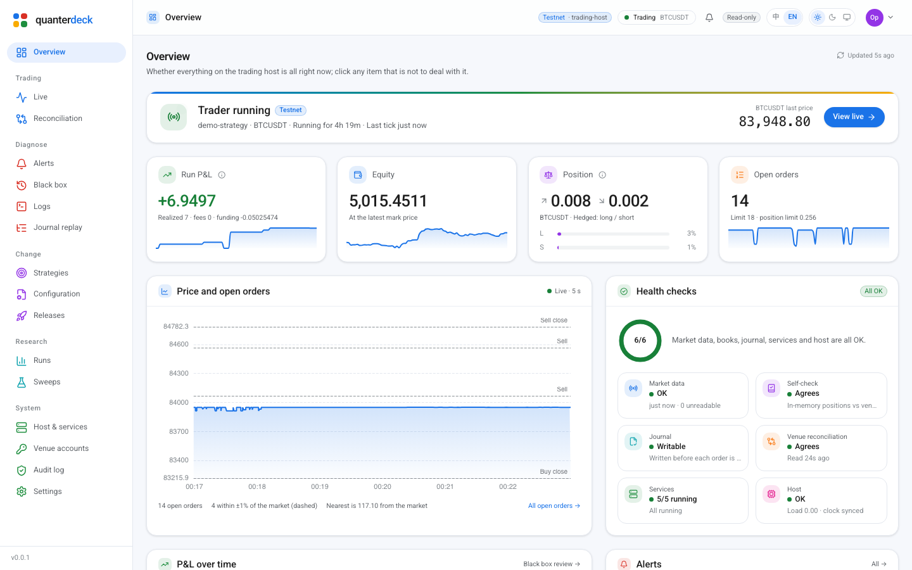
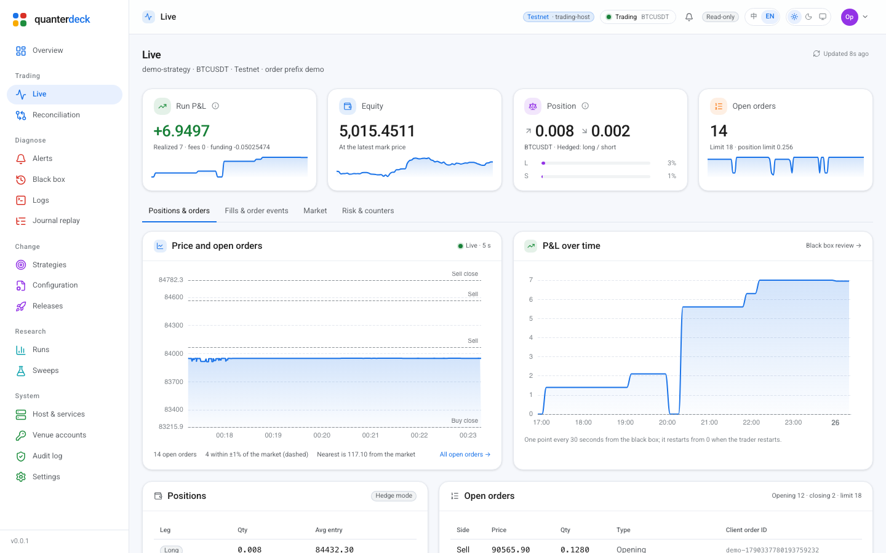
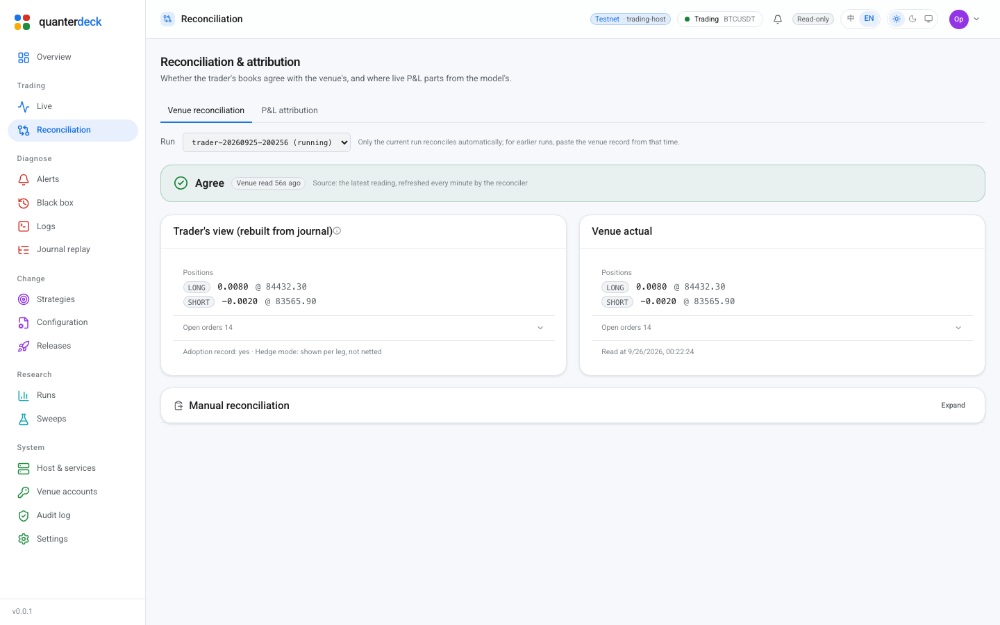
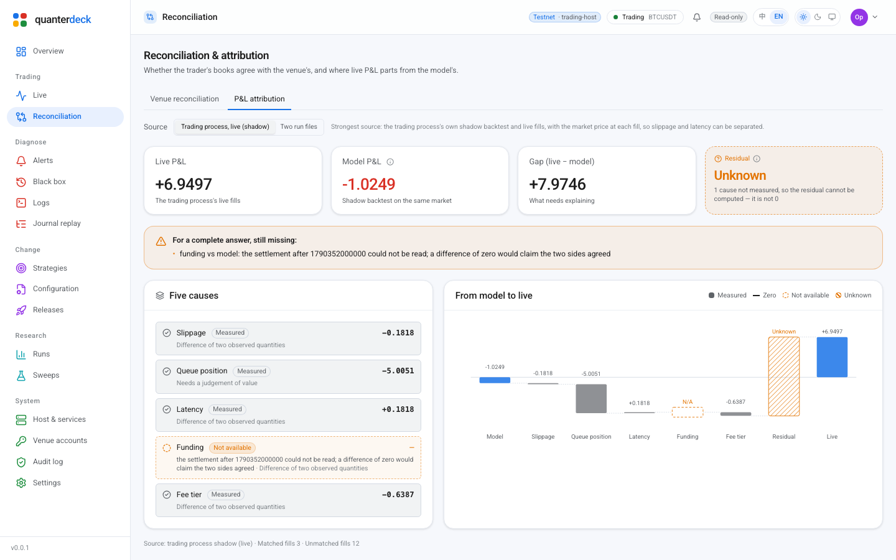
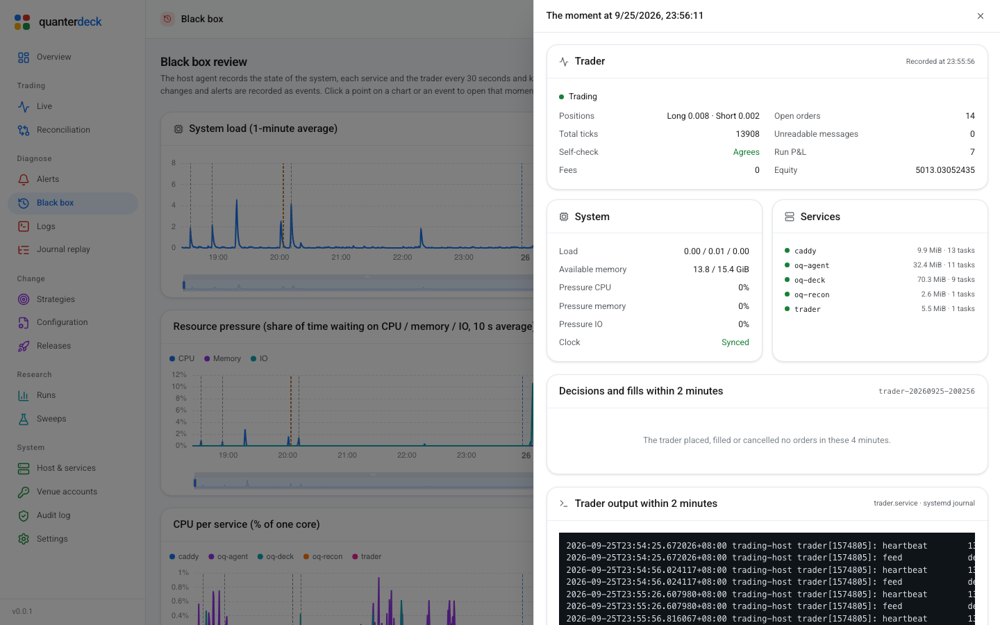
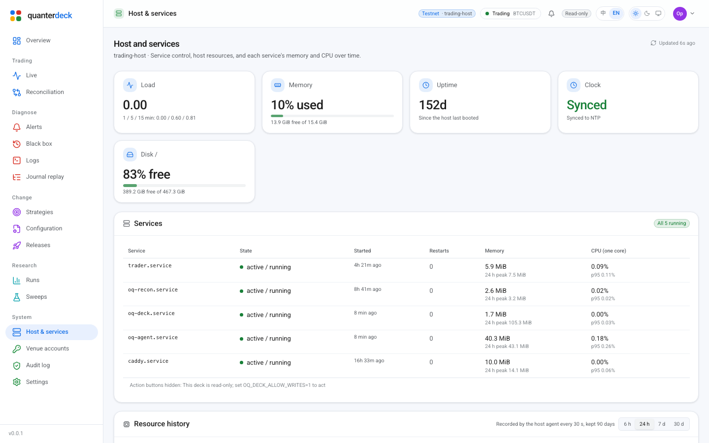
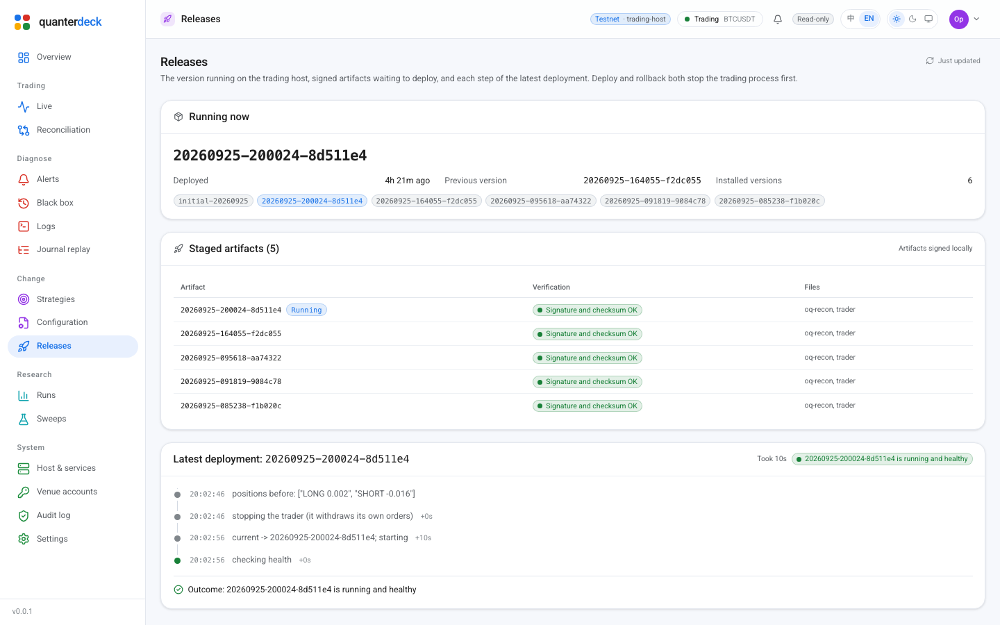

# Quanterdeck

**A self-hosted console for OpenQuanter. Your keys stay on your machine.**

English · [中文](README.zh-CN.md) · Website: [openquanter.com](https://openquanter.com/#deck)

> ⚠️ Early development. APIs are unstable. Not financial
> advice; use at your own risk.

---

## What this is

[OpenQuanter](https://github.com/openquanter/openquanter) accounts for
every cent — identity triples, fill-by-fill parity, gap attribution, the
residual that will not decompose. Those numbers currently exist in files
and in terminal output. Quanterdeck is the layer that makes them
something you can look at.

> **Someone with no quant experience gets their first equity curve on
> their own machine within thirty minutes; someone with experience never
> reads "cannot tell" as "all clear".**

The second half matters as much as the first. Part of this console's job
is to say no.

## What it looks like

The overview answers one question — is the trading host all right — and every "no" links to where it is dealt with.



<table>
  <tr>
    <td width="50%"><br><sub>Live: positions, orders, fills, market and risk limits on one page</sub></td>
    <td width="50%"><br><sub>Venue reconciliation: what the process believes against what the venue holds</sub></td>
  </tr>
  <tr>
    <td width="50%"><br><sub>Attribution: five causes in three states; an unknown residual is not zero</sub></td>
    <td width="50%"><br><sub>Black box: any moment, opened up</sub></td>
  </tr>
  <tr>
    <td width="50%"><br><sub>Host and services</sub></td>
    <td width="50%"><br><sub>Releases: signed builds, deploy and roll back</sub></td>
  </tr>
</table>

Generated from a running deck by `scripts/screenshots.py`, with the deployment's names replaced before the pictures are taken; rerun it after a UI change.

## What it is not

- **Not hosted, not a SaaS, and it does not hold your API keys.** Custody
  of user keys is a non-goal upstream, and it is one here.
- **Not a market terminal, a copy-trading network, or a strategy store.**
- **Not a judge of whether your strategy is any good.** It makes sure you
  ran the backtest before going live, not that the backtest meant anything.
- **Not a change to the framework.** The console is a consumer with a
  one-way dependency on the public crates. The framework need not know it
  exists.

## It requires a login, unconditionally

Loopback is not a security boundary. Other processes and other accounts
on the same machine can open the port; a page in the operator's browser
can reach `127.0.0.1` by DNS rebinding; the first `ssh -L` makes
"listens locally" describe the socket and nothing about who is on the
other end; and with writes enabled it places orders.

So: an Argon2id password, always; a `Host` allowlist; an `Origin` check
on writes; `HttpOnly` + `SameSite=Strict` sessions; lockout after
repeated failures; and a mandatory second factor off the loopback
interface. On a first start with no password, the deck prints a one-time
token to the terminal it was started from — reading it takes the local
access the operator already has, and the token lives only in memory.
Started by a service manager, stderr is the journal rather than a
terminal: a token printed there has been written to a file that is
copied, so it is not printed. The deck writes it to `RUNTIME_DIRECTORY`
instead when one is set, and otherwise says that it did neither — run it
once in a terminal, or give the unit a writable runtime directory.

The threat model, the measures, and **what is not done yet** are in
[docs/SECURITY.zh-CN.md](docs/SECURITY.zh-CN.md).

## Three rules, in code rather than in prose

**1. "Cannot tell" never renders as "they agree".** When a baseline is
invalidated — the input data or effective configuration moved — nothing
about the engine can be concluded. `passes` is false, the difference list
is empty, and the banner is amber rather than red, with what to do about
it: rebase. It is not a regression, and colouring it like one sends
someone hunting a bug that is not there.

**2. An incomplete decomposition has an unknown residual, not a zero
one.** When any component is unavailable, the residual is `None`. A zero
computed from a partial decomposition claims everything was explained,
which is precisely the claim it must not make.

**3. Reading never changes the runtime.** The console is an observer.
That is upstream's FR-CORE-7, applied here.

## Status

Against a directory of run files it can:

- list every run **including the one that will not parse** — with its
  reason, rather than absent from the listing
- show the identity triple, the fills and the realized P&L; an untagged
  fill and an empty-tagged one look different, because they are
- compare two runs and distinguish three verdicts: comparable, code
  changed, and **baseline invalidated**; and compare their fills by
  markout against a tick file
- show a parameter sweep (`.sweep` files) with the refusals, the
  deflated Sharpe and the PBO **before** the table of configurations
- report its own capabilities, rendering no control for what it cannot
  do and saying why
- start read-only and loopback-only, and **refuse to start** when told to
  listen elsewhere without a password and a second factor

Against a directory of journals it reconstructs what each process
believed it held — leg by leg on a hedged account — reports how many
frames it could not decode, compares that against a venue record
(pasted, or the watcher's latest reading), and replays a journal event
by event, filtered by kind.

It decomposes the gap between a live run and a model run into five
causes — keeping **measured zero** and **not measured** apart, and
returning a null residual rather than a zero one whenever the
decomposition is incomplete — from run files, or live from the trader's
own shadow model.

With a host agent (`oq-agent`, in this repository) running on the
trading host as its own user, it also operates that host:

- the trader's status — positions, resting orders, the run's P&L, the
  risk limits in force, halt state — from its control port; unit state
  and start/stop/restart; halt, shutdown and resume
- log tails, from files and from each service's systemd journal
- several traders on one host: each found by its control socket, a
  Traders page grouping them by strategy and symbol, status and
  halt/resume/shutdown addressed to one by name (`?trader=`), and alerts
  and black-box lines that name the trader they are about — with one
  trader everything reads exactly as before
- signed-release deployment with a health check and automatic rollback
- strategy configuration: form and raw JSON, a diff before saving, a
  backup of every version, rollback
- the promotion gate for each strategy instance, draft to live, with the
  reason a step is closed and a configuration change sending it back
- alerts (a halt, a books mismatch, a stopped unit, a full disk, an
  unsynced clock, a service whose memory keeps growing), their history,
  a test send and silencing; which venue account each process uses; the
  live feed's quality
- a **black box**: every 30 s, kept 90 days, the host (load, memory,
  pressure, clock, disks), each service (memory, CPU, tasks) and the
  trader's status, with state changes and alerts as events — and a
  review page that opens any moment: the snapshot then, the trader's
  decisions and fills around it, and its output around it. Each trader
  sample is checked against the one before — a position or realized P&L
  that moved without a fill, a counter that went down, a net P&L that is
  not realized less fees plus funding — agree, disagree or cannot tell,
  and a disagreement is an event and an alert

It also says whether what runs is behind the framework's newest
GitHub release: the deck's own pinned commit (read from `Cargo.lock` at
build time) and the trader's (from the current release's manifest), each
compared by GitHub against the release's commit — includes it, N commits
behind, diverged, or **cannot tell** with the reason. A failed check is
shown as failed, beside the last successful answer and its age, never as
"up to date". The same check compares the deck's own version with
Quanterdeck's newest release. These are the deck's only outbound
requests, all to the GitHub API; see Configuration to point them
elsewhere or turn them off.

Anything risky needs a reason and a one-time code **the agent**
verifies, so a compromised deck cannot act alone. Every action goes
into a hash-chained audit trail and to the alert channel.

The interface is organised by what an operator does — trading,
diagnosis, change, research, system — with the environment, the
trader's state and the alert count always in the top bar, and every
term's meaning a hover away (see [docs/UI-V4.zh-CN.md](docs/UI-V4.zh-CN.md)).
The interface is in Chinese and English, switched from the top bar or Settings.

## Getting started

```bash
git clone https://github.com/openquanter/quanterdeck
cd quanterdeck

cd web && npm install && npm run build && cd ..   # Node is build-time only
export OQ_DECK_RUNS_DIR=/path/to/your/runs
export OQ_DECK_JOURNALS_DIR=/path/to/your/journals   # for reconciliation
export OQ_DECK_TICKS_DIR=/path/to/your/ticks         # .oqtk files, for markouts
cargo run -p oq-deck                              # http://127.0.0.1:8899
```

The first start prints a one-time token — to the terminal, or to
`RUNTIME_DIRECTORY/setup-token` when stderr is not one. Use it at
`/setup` to set a password, then put the returned
`OQ_DECK_PASSWORD_HASH` in the environment and restart. Until then every
API route but `/api/v1/health`, `/api/v1/session`,
`/api/v1/session/login` and `/api/v1/setup` returns 401.

With no runs of your own, use the ones in the repository:

```bash
export OQ_DECK_RUNS_DIR=$PWD/examples/fixtures/runs
```

They are written by the framework's own writer
(`cargo run -p oq-deck-core --example make_fixtures`), so the format is
correct by construction — and one of them is deliberately truncated, to
show what the listing does with a file it cannot read.

## Releases

Releases are numbered in plain sequence — `1.0.0`, `1.0.1`, `1.0.2`, … —
independently of the framework, and each GitHub Release says which
framework commit it was built against. A release ships, for Linux x86-64
and aarch64, a bundle with `bin/oq-deck`, `bin/oq-agent` and the built
interface in `web-dist/` (point `OQ_DECK_WEB_DIST` at it), plus its
SHA-256. No Node or Rust toolchain is needed to run one.

```bash
v=1.0.0; t=x86_64-unknown-linux-gnu
curl -LO https://github.com/openquanter/quanterdeck/releases/download/v$v/quanterdeck-v$v-$t.tar.gz{,.sha256}
sha256sum -c quanterdeck-v$v-$t.tar.gz.sha256 && tar xzf quanterdeck-v$v-$t.tar.gz
```

A running deck tells you when a newer one exists: the overview's
"Upstream release" card compares it with the newest release.

**Cutting one.** In a pull request, set `[workspace.package].version` in
`Cargo.toml` and `version` in `web/package.json` (and its lock file), and
rename the changelog's `## Unreleased` to `## X.Y.Z — <date>` with a new
empty `## Unreleased` above it. Merge, then tag that commit on `main`:
`git tag -a vX.Y.Z -m vX.Y.Z && git push origin vX.Y.Z`.
`.github/workflows/release.yml` refuses unless the tag, both versions and
the changelog agree and the commit is on `main`, runs the full CI gate,
builds the bundles and publishes the release with the changelog section
as its notes. A tag that fails publishes nothing; a number once tagged is
not reused.

## Configuration

The deck:

| Variable | What it does |
|---|---|
| `OQ_DECK_HOST`, `OQ_DECK_PORT` | Listen address; `127.0.0.1:8899` by default. Anything but loopback needs a second factor |
| `OQ_DECK_PASSWORD_HASH` | The Argon2id hash `/setup` returns |
| `OQ_DECK_TOTP_SECRET` | The second factor; required when reachable from elsewhere |
| `OQ_DECK_BEHIND_TLS` | `1` behind a TLS reverse proxy: cookies are `Secure` |
| `OQ_DECK_EXTRA_HOSTS` | Host names beyond the listen address that may reach it (a reverse proxy's) |
| `OQ_DECK_RUNS_DIR` | Run files and `.sweep` files |
| `OQ_DECK_JOURNALS_DIR` | Journals, for reconciliation and replay |
| `OQ_DECK_TICKS_DIR` | `.oqtk` tick files, for markouts |
| `OQ_DECK_VENUE_RECORD` | The watcher's latest venue reading, for reconciliation without pasting |
| `OQ_DECK_AGENT_SOCKET` | The host agent's socket; without it there are no operations |
| `OQ_DECK_ALLOW_WRITES` | `1` to allow actions at all; read-only otherwise |
| `OQ_DECK_STATE_DIR` | Where it keeps the browsers you enrolled; `STATE_DIRECTORY` if unset, and with neither it remembers nobody |
| `OQ_DECK_SESSION_IDLE_MINUTES` | `60` | How long a session survives without use |
| `OQ_DECK_SESSION_HOURS` | `12` | How long a session survives at all |
| `OQ_DECK_DEVICE_DAYS` | `90` | How long an enrolled browser is trusted |
| `OQ_DECK_TRUSTED_KEYS` | An `allowed_signers` file: the keys `scripts/deck-enrol.sh` may enrol a browser with, on a machine that has no password yet. Unset means no key can |
| `OQ_DECK_UPSTREAM_REPO` | `openquanter/openquanter` | The GitHub repository whose newest release is compared with what runs |
| `OQ_DECK_SELF_REPO` | `openquanter/quanterdeck` | This console's own repository: its newest release is compared with the version the deck was built as. Same schedule, switch and proxy as the framework check; one request more |
| `OQ_DECK_UPSTREAM_CHECK_HOURS` | `6` | How often to check, 0 to 168. `0` turns the check off: no request to GitHub at all |
| `OQ_DECK_UPSTREAM_PROXY` | — | An `http://` proxy for that check only; the ambient `HTTPS_PROXY` is not read |
| `OQ_DECK_WEB_DIST` | The built interface; `web/dist` beside the source by default |

The agent (`oq-agent`), whose defaults fit a host laid out as the
reference deployment is:

| Variable | Default | What it does |
|---|---|---|
| `OQ_AGENT_SOCKET` | `$RUNTIME_DIRECTORY/agent.sock` | Where the deck reaches it |
| `OQ_AGENT_PEERS` | `oq-deck` | Users allowed to connect |
| `OQ_AGENT_UNITS` | the trader, watcher, deck and agent | Units shown and recorded |
| `OQ_AGENT_MANAGEABLE` | `trader.service,oq-recon.service` | Units it may start and stop |
| `OQ_AGENT_TRADER_UNIT` | `trader.service` | The trader |
| `OQ_AGENT_RELEASE_BINARIES` | the trader's binary, `oq-recon` | The binaries a signed release may carry |
| `OQ_AGENT_CONTROL_DIR` | `/run/oq-live` | The traders' control socket directory; each `<name>.sock` is one trader |
| `OQ_AGENT_LOG_DIR` | `/var/log/oq` | Log files |
| `OQ_AGENT_STATE` | `/var/lib/oq-agent` | Audit trail, alerts, black box, gate state |
| `OQ_AGENT_RELEASES`, `OQ_AGENT_INCOMING` | `/opt/oq/releases`, `/var/lib/oq/incoming` | Installed and staged releases |
| `OQ_AGENT_SIGNERS` | `/etc/oq/allowed_signers` | The only keys whose releases it installs |
| `OQ_AGENT_CONFIG_DIR` | `/var/lib/oq/config` | Strategy configuration it may change |
| `OQ_AGENT_JOURNALS` | `/var/lib/oq/journals` | Journals, for the promotion gate's evidence |
| `OQ_AGENT_HOST` | `host` | The host's name in alerts |
| `OQ_AGENT_DISCORD_GUILD`, `OQ_AGENT_DISCORD_CHANNEL` | —, `alerts` | Where alerts go; the bot token comes as the `DISCORD_BOT_TOKEN` systemd credential. The audit trail and the journal are anchored by reading this channel back |
| `OQ_AGENT_TELEGRAM_CHAT` | — | A Telegram chat that also gets every alert; the bot token comes as the `TELEGRAM_BOT_TOKEN` systemd credential. On only when both are present (a startup warning names the missing half). Delivery only: a Telegram bot cannot read a chat's history, so the off-host anchor stays on Discord |
| `OQ_AGENT_PROXY` | — | An HTTP proxy for the alert channels |

## Docs

| Doc | What it holds |
|---|---|
| [STACK.zh-CN.md](docs/STACK.zh-CN.md) | Why this stack, what was rejected, and what v1 got wrong |
| [UI-BRIEF.zh-CN.md](docs/UI-BRIEF.zh-CN.md) | The brief for design: each screen's data, states and verdicts |
| [SECURITY.zh-CN.md](docs/SECURITY.zh-CN.md) | Threat model, measures, and what is not done yet |
| [AGENTS.md](AGENTS.md) | Local commands and the ten invariants |

## Licence

Apache-2.0. Contributions need a DCO sign-off (`git commit -s`); see
[CONTRIBUTING.md](CONTRIBUTING.md).
